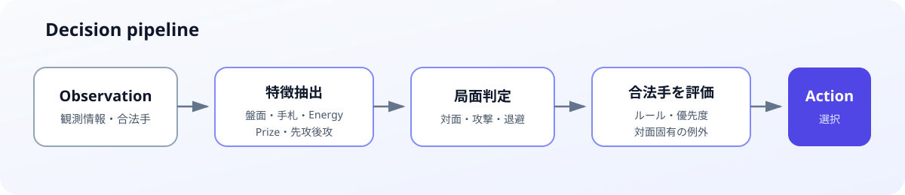
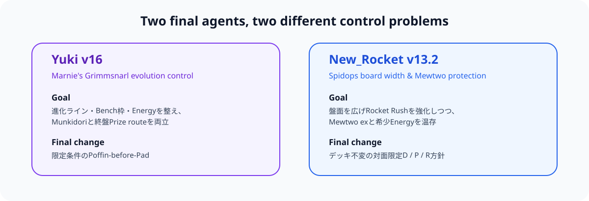
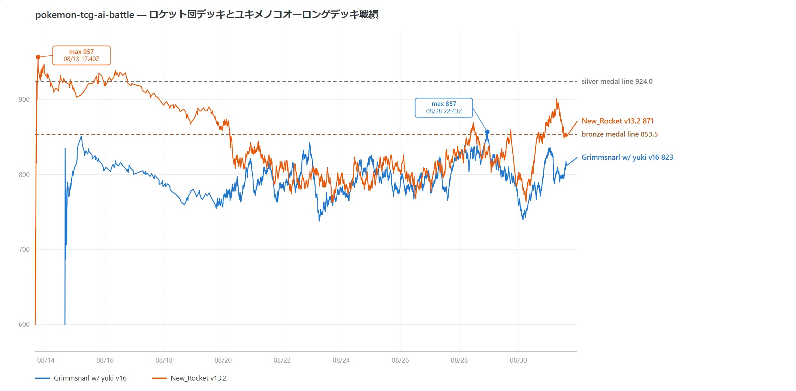
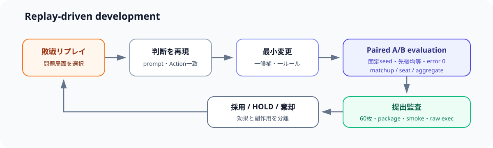

# PTCG AI Battle Challenge Simulation

Kaggle「[The Pokémon Company - PTCG AI Battle Challenge Simulation](https://www.kaggle.com/competitions/pokemon-tcg-ai-battle)」で開発した、リプレイ主導のルールベース対戦エージェントに関するポートフォリオです。

- **最終順位:** 590 / 6,807チーム（上位約8.7%）
- **受賞:** Bronze Medal
- **最終提出エージェント:** Yuki v16 / New_Rocket v13.2
- **主な手法:** 敗戦リプレイ分析、局面別ルール、固定seed・先後均等のpaired A/B評価

## Competition

このコンペティションでは、不完全情報ゲームであるPokémon Trading Card Gameを対象に、毎ターン与えられる観測情報と合法手から行動を選択するAIエージェントを開発します。

エージェントはカードの価値だけでなく、盤面、手札、Energy、Prize race、先攻・後攻、相手のデッキ系統を踏まえて行動する必要があります。

## Approach

コンペ期間、利用可能な計算資源、判断の追跡可能性を考慮し、ルールベース方式を採用しました。ルールベースは、Kaggleの敗戦リプレイで見つけた判断ミスを局面単位で再現し、条件を限定した修正として検証できる点を重視しています。



開発では、変更を一度に重ねず、原則として一つの判断ルールを分離しました。候補は同じseed streamと先後均等の対戦で比較し、改善が再現しないものや他対面を悪化させるものは提出版へ含めませんでした。

詳しい評価設計は[Methodology](docs/methodology.md)、代表的な採否判断は[Experiments](docs/experiments.md)にまとめています。

## Final Agents

### Yuki v16

Marnie's Grimmsnarlを中心とした進化デッキ向けエージェントです。序盤のImpidimp展開、Rare Candyを含む進化経路、MunkidoriのBench運用、Energy配分、終盤のBoss's Ordersを使ったPrize取得を局面別に制御します。

v16では、最初の自分のターンに限定し、盤面条件を満たす場合だけBuddy-Buddy PoffinをPoke Padより先に処理します。Poffinで制約の強いImpidimp探索を先に済ませ、Poke Padの柔軟な探索を残すための限定ルールです。

- [Yuki v16の詳細](agents/yuki_v16/README.md)
- ローカル提出物: `agents/yuki_v16/submission/`

### New_Rocket v13.2

Team Rocket's Spidopsを主力とし、Team Rocket's Mewtwo exを終盤の攻撃役として扱うエージェントです。Protonによる盤面展開、Rocket Rushの打点、Mewtwo exの保護、Team Rocket Energyの配分、MimikyuやNeutralization Zoneの利用を対面別に制御します。

v13.2はv13と同じordered 60-card deckを維持し、Ogerpon対面、山札切れを伴う勝利判定、Crustle/Kangaskhan系の盤面に対する限定方針を追加したpolicy-only releaseです。

- [New_Rocket v13.2の詳細](agents/new_rocket_v13_2/README.md)
- ローカル提出物: `agents/new_rocket_v13_2/submission/`



## Score Fluctuation After Submission

提出後のLeaderboard scoreの変動を、Yuki v16とNew_Rocket v13.2について記録しました。



画像上の最終表示は、New_Rocket v13.2が871、Yuki v16が823です。点線は画像内に表示されたBronze Medal line（853.5）とSilver Medal line（924.0）を示しています。

これは提出後の時系列記録であり、他参加者の提出やLeaderboardの更新も含む観測値です。したがって、個別の方針変更の因果効果を示すA/B評価ではなく、最終提出後の競争上の位置の推移として解釈します。

## Evaluation Workflow



## Repository Structure

```text
.
├── README.md
├── agents/
│   ├── yuki_v16/
│   │   ├── README.md
│   │   └── submission/
│   └── new_rocket_v13_2/
│       ├── README.md
│       └── submission/
├── docs/
│   ├── methodology.md
│   ├── experiments.md
│   └── development-history.md
├── assets/
└── evidence/
    ├── README.md
    └── submission-manifest.md
```

## Reproducibility and Provenance

提出アーカイブのハッシュ、内容一覧、ordered deckは現在のファイルから確認しています。当時のローカル勝率や信頼区間は、開発終了時の全期間まとめに記録された履歴値です。元の実験スクリプトや生ログがない数値を、現在再実行済みの結果としては扱いません。

アーカイブにはコンペティション提供の`cg`ランタイムや、公開Notebookを起点としたコードが含まれます。第三者ファイルの再配布条件を確認するまで、提出アーカイブと展開物はGitの追跡対象外としています。

## Documentation

- [Methodology](docs/methodology.md): ルールベース設計、リプレイ再現、paired A/B評価、提出監査
- [Experiment Highlights](docs/experiments.md): 代表的な採用・HOLD・棄却判断
- [Development History](docs/development-history.md): 2か月の開発史と最終2系統の発展経路
- [Submission Artifact Manifest](evidence/submission-manifest.md): 回収アーカイブの現在確認済み情報
- [Evidence](evidence/README.md): 順位・メダルなど公開実績の証拠配置方針

## Attribution

初期のルールベース構造では、ryotasueyoshi氏の[Rule-based, Not Psychic! Alakazam - Best 5th](https://www.kaggle.com/code/ryotasueyoshi/rule-based-not-psychic-alakazam-best-5th?scriptVersionId=328654333)を参考にしました。

New_Rocketの初期Team Rocketゲームプランは、Kaggle上の「Oshbocker」の公開対戦履歴を分析しています。

本プロジェクトで追加・検証した主な対象は、デッキ固有の状態判定、対面別の戦術ルーティング、リプレイ再現、paired A/B評価、提出パッケージ監査です。
